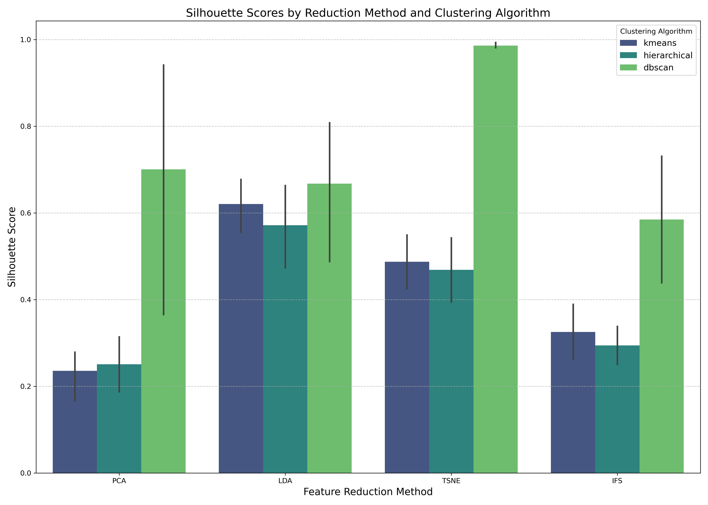
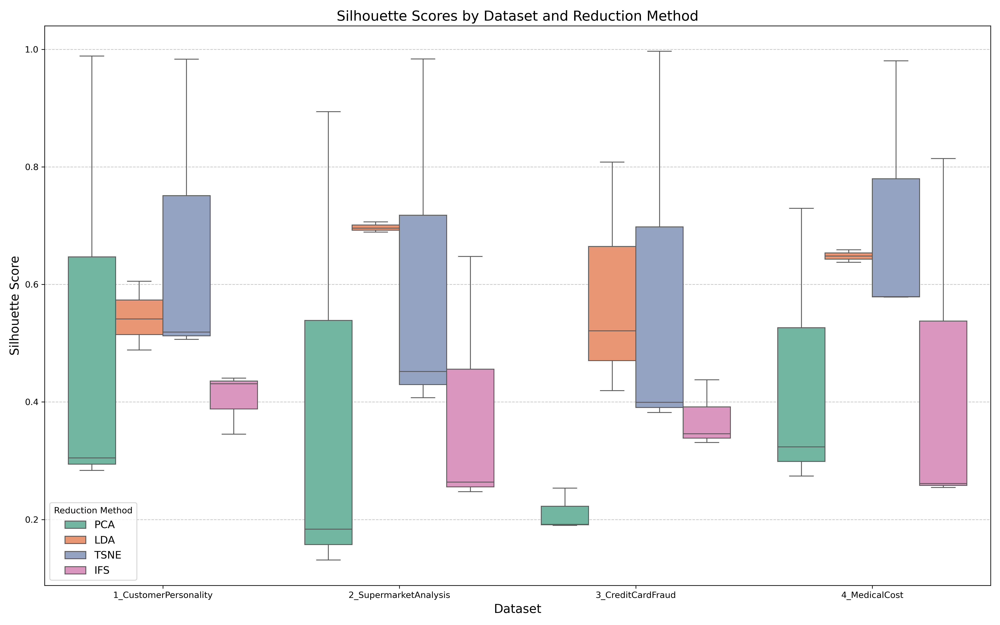
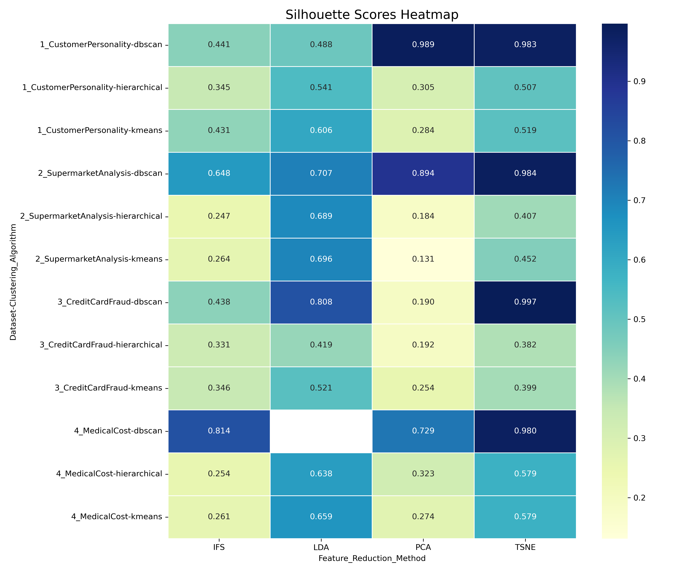

# Comprehensive Analysis of Feature Selection and Dimensionality Reduction Techniques

## Overview

This document provides a detailed analysis of various feature selection and dimensionality reduction techniques applied to four distinct datasets. The techniques evaluated include Principal Component Analysis (PCA), Linear Discriminant Analysis (LDA), t-Distributed Stochastic Neighbor Embedding (t-SNE), and Incremental Feature Selection (IFS). Each method was applied to reduce the dimensionality of the datasets, followed by clustering using KMeans, Hierarchical Clustering, and DBSCAN algorithms. The quality of the resulting clusters was evaluated using the Silhouette Score metric.

## Table of Contents

1. [Methodology](#methodology)
2. [Dataset Profiles](#dataset-profiles)
3. [Feature Selection and Dimensionality Reduction Techniques](#feature-selection-and-dimensionality-reduction-techniques)
4. [Clustering Algorithms](#clustering-algorithms)
5. [Individual Dataset Results](#individual-dataset-results)
6. [Comparative Analysis](#comparative-analysis)
7. [Visualizations](#visualizations)
8. [Final Conclusions](#final-conclusions)

## Methodology

The analysis followed a structured approach:

1. **Data Preprocessing**:
   - Handling missing values through imputation
   - Identifying categorical and numerical features
   - Standardizing numerical features
   - One-hot encoding categorical features
   - Identifying potential target variables for supervised methods

2. **Dimensionality Reduction**:
   - Applying PCA to capture variance in the data
   - Using LDA for class-aware dimensionality reduction
   - Implementing t-SNE for non-linear dimensionality reduction
   - Employing IFS to select the most informative features

3. **Clustering**:
   - Applying KMeans with varying numbers of clusters (2-10)
   - Using Hierarchical (Agglomerative) Clustering with varying numbers of clusters (2-10)
   - Implementing DBSCAN with different epsilon and minimum samples parameters

4. **Evaluation**:
   - Computing Silhouette Scores to assess cluster quality
   - Identifying optimal parameters for each clustering algorithm
   - Comparing performance across reduction methods and datasets

## Dataset Profiles

### 1. Customer Personality Analysis (1_CustomerPersonality)

**Characteristics**:
- A marketing dataset focused on customer behaviors and demographics
- Contains a mix of categorical and numerical features
- Includes information about customer spending patterns, campaign responses, and demographics
- No explicit target variable, but contains potential class indicators like campaign responses

**Key Features**:
- Demographic attributes: Age, Education, Marital_Status
- Spending patterns: Spent, Wines, Meat, Fish, etc.
- Campaign responses: AcceptedCmp1-5, Response
- Purchase behaviors: NumWebPurchases, NumStorePurchases, NumCatalogPurchases

**Dimensionality**:
- Moderate number of features with clear semantic meaning
- Good candidate for interpretable feature selection

### 2. Supermarket Analysis (2_SupermarketAnalysis)

**Characteristics**:
- Retail dataset focused on customer purchasing patterns
- High dimensionality due to one-hot encoded product categories
- Temporal components through order information
- Primarily transaction-based data

**Key Features**:
- Order information: order_number, order_dow, days_since_prior_order
- Product categories: Various product_name_* features
- User behavior: add_to_cart_order, reordered

**Dimensionality**:
- High dimensionality with many sparse features
- Good candidate for dimensionality reduction techniques

### 3. Credit Card Fraud Detection (3_CreditCardFraud)

**Characteristics**:
- Financial dataset focused on identifying fraudulent transactions
- Likely contains anonymized or transformed features for privacy
- Binary classification problem (fraud vs. legitimate)
- Potentially imbalanced classes

**Key Features**:
- Customer IDs: Various CUST_ID_* features
- Likely contains transaction amounts, timestamps, and merchant information (though anonymized)

**Dimensionality**:
- High dimensionality with potentially redundant features
- Good candidate for both dimensionality reduction and feature selection

### 4. Medical Cost Prediction (4_MedicalCost)

**Characteristics**:
- Healthcare dataset focused on predicting medical costs
- Mix of demographic and health-related features
- Contains both categorical and numerical features
- Regression problem with 'charges' as the target variable

**Key Features**:
- Demographic information: age, region
- Health indicators: bmi, smoker status
- Family information: children
- Target variable: charges

**Dimensionality**:
- Relatively low dimensionality with clear semantic meaning
- Good candidate for interpretable feature selection

## Feature Selection and Dimensionality Reduction Techniques

### Principal Component Analysis (PCA)

**Methodology**:
- Unsupervised technique that identifies directions (principal components) of maximum variance
- Transforms the data into a new coordinate system where features are uncorrelated
- Retains components that explain a specified amount of variance (default: 90%)
- Feature importance is determined by the total absolute loading across all retained components

**Strengths**:
- Effective at capturing variance in the data
- Reduces dimensionality while preserving information
- Handles multicollinearity by creating orthogonal components
- Works well with numerical data

**Limitations**:
- Assumes linear relationships between features
- May not preserve class separability
- Transformed features lose interpretability
- Sensitive to feature scaling

**Implementation Details**:
```python
def apply_pca(X, feature_names, variance_threshold=0.9):
    # Apply PCA
    pca = PCA()
    X_pca = pca.fit_transform(X)
    
    # Determine number of components for desired variance
    explained_variance_ratio_cumsum = np.cumsum(pca.explained_variance_ratio_)
    n_components = np.argmax(explained_variance_ratio_cumsum >= variance_threshold) + 1
    
    # Calculate total absolute loading across all components for each feature
    total_loadings = {}
    for i in range(n_components):
        loadings = np.abs(pca.components_[i])
        for j, loading in enumerate(loadings):
            feature_name = feature_names[j] if j < len(feature_names) else f"Feature_{j}"
            if feature_name in total_loadings:
                total_loadings[feature_name] += loading
            else:
                total_loadings[feature_name] = loading
    
    # Sort features by total absolute loading
    sorted_features = sorted(total_loadings.items(), key=lambda x: x[1], reverse=True)
    
    # Get top 5 features with highest total absolute loading
    top_5_features = sorted_features[:5]
    
    return X_pca[:, :n_components], n_components, top_5_features
```

### Linear Discriminant Analysis (LDA)

**Methodology**:
- Supervised technique that finds linear combinations of features that maximize class separability
- Projects data onto a lower-dimensional space while preserving class information
- When no target is available, uses KMeans to generate pseudo-labels
- Feature importance is determined by the absolute coefficient values

**Strengths**:
- Explicitly considers class information
- Maximizes between-class variance and minimizes within-class variance
- Can be used for both dimensionality reduction and classification
- Often outperforms PCA for classification tasks

**Limitations**:
- Requires class labels or pseudo-labels
- Assumes classes are linearly separable
- Assumes features follow a Gaussian distribution
- Limited to C-1 components (where C is the number of classes)

**Implementation Details**:
```python
def apply_lda(X, feature_names, target=None, n_clusters=3):
    # If no target is provided, generate pseudo-labels using KMeans
    if target is None:
        kmeans = KMeans(n_clusters=n_clusters, random_state=42)
        target = kmeans.fit_predict(X)
    
    # Apply LDA
    n_components = min(len(np.unique(target)) - 1, X.shape[1])
    lda = LDA(n_components=n_components)
    X_lda = lda.fit_transform(X, target)
    
    # Get feature importance
    feature_importance = []
    all_features_importance = {}
    
    for i in range(n_components):
        coefficients = np.abs(lda.coef_[i] if lda.coef_.ndim > 1 else lda.coef_)
        top_indices = coefficients.argsort()[::-1]
        top_features = [(feature_names[idx] if idx < len(feature_names) else f"Feature_{idx}", coefficients[idx]) 
                        for idx in top_indices]
        feature_importance.append(top_features)
        
        # Aggregate feature importance across all components
        for feature, coef in top_features:
            if feature in all_features_importance:
                all_features_importance[feature] = max(all_features_importance[feature], coef)
            else:
                all_features_importance[feature] = coef
    
    # Get top 5 features across all components
    top_features_overall = sorted(all_features_importance.items(), key=lambda x: x[1], reverse=True)[:5]
    
    return X_lda, feature_importance, top_features_overall
```

### t-Distributed Stochastic Neighbor Embedding (t-SNE)

**Methodology**:
- Non-linear technique that models similar data points as nearby points and dissimilar data points as distant points
- Particularly effective for visualizing high-dimensional data in 2D or 3D space
- Preserves local structure of the data
- Does not provide feature importance scores

**Strengths**:
- Excellent for visualization
- Preserves local structure and clusters
- Handles non-linear relationships
- Often reveals patterns not visible with linear methods

**Limitations**:
- Computationally intensive
- Results can vary with different random initializations
- Does not provide feature importance
- Not suitable for dimensionality reduction beyond visualization

**Implementation Details**:
```python
def apply_tsne(X):
    # Apply t-SNE
    tsne = TSNE(n_components=2, random_state=42)
    X_tsne = tsne.fit_transform(X)
    
    return X_tsne
```

### Incremental Feature Selection (IFS)

**Methodology**:
- Supervised technique that ranks features based on their importance
- Uses statistical tests (F-test or mutual information) to score features
- When no target is available, uses KMeans to generate pseudo-labels
- Selects top-k features based on their scores

**Strengths**:
- Maintains feature interpretability
- Directly identifies the most informative features
- Can be used with different scoring functions
- Computationally efficient

**Limitations**:
- May not capture interactions between features
- Requires class labels or pseudo-labels
- Different scoring functions may yield different results
- May not perform well if important information is spread across many features

**Implementation Details**:
```python
def apply_ifs(X, feature_names, target=None, method='f_test', k_values=[5, 10, 15]):
    # If no target is provided, generate pseudo-labels using KMeans
    if target is None:
        kmeans = KMeans(n_clusters=3, random_state=42)
        target = kmeans.fit_predict(X)
    
    # Choose the scoring function
    if method == 'f_test':
        score_func = f_classif
    else:  # method == 'mutual_info'
        score_func = mutual_info_classif
    
    # Apply feature selection
    selector = SelectKBest(score_func=score_func, k='all')
    selector.fit(X, target)
    
    # Get feature scores and indices
    scores = selector.scores_
    if np.any(np.isnan(scores)):
        scores = np.nan_to_num(scores)
    
    # Sort features by importance
    indices = np.argsort(scores)[::-1]
    ranked_features = [(feature_names[idx] if idx < len(feature_names) else f"Feature_{idx}", scores[idx]) 
                      for idx in indices]
    
    # Get top 5 features
    top_5_features = ranked_features[:5]
    
    return ranked_features, top_5_features
```

## Clustering Algorithms

### KMeans

**Methodology**:
- Partitions data into k clusters by minimizing the within-cluster sum of squares
- Iteratively assigns points to the nearest centroid and updates centroids
- Requires specifying the number of clusters (k)
- Evaluated with Silhouette Score to determine optimal k

**Strengths**:
- Simple and intuitive
- Computationally efficient
- Works well with globular clusters
- Scales to large datasets

**Limitations**:
- Requires specifying the number of clusters
- Sensitive to initial centroid placement
- Assumes clusters are spherical and equally sized
- May converge to local optima

### Hierarchical (Agglomerative) Clustering

**Methodology**:
- Builds a hierarchy of clusters by iteratively merging the closest clusters
- Starts with each point as its own cluster and progressively merges them
- Does not require specifying the number of clusters in advance
- Evaluated with Silhouette Score to determine optimal number of clusters

**Strengths**:
- Does not require specifying the number of clusters in advance
- Produces a dendrogram showing the hierarchy of clusters
- Can capture clusters of different shapes and sizes
- Less sensitive to initialization

**Limitations**:
- Computationally intensive for large datasets
- Cannot undo previous merge decisions
- Sensitive to outliers
- Different linkage criteria can yield different results

### DBSCAN (Density-Based Spatial Clustering of Applications with Noise)

**Methodology**:
- Identifies clusters as dense regions separated by sparse regions
- Requires specifying the maximum distance between points (eps) and minimum number of points to form a dense region (min_samples)
- Automatically identifies outliers as noise
- Evaluated with Silhouette Score to determine optimal parameters

**Strengths**:
- Does not require specifying the number of clusters
- Can find clusters of arbitrary shapes
- Robust to outliers
- Does not assume any particular cluster shape

**Limitations**:
- Sensitive to parameter selection (eps and min_samples)
- Struggles with clusters of varying densities
- May have difficulty with high-dimensional data
- Computationally intensive for large datasets

## Individual Dataset Results

### 1. Customer Personality Analysis

#### PCA Results

**Top Features**:
- Education (Score: 3.567)
- AcceptedCmp3 (Score: 3.458)
- Age (Score: 3.389)
- AcceptedCmp4 (Score: 3.231)
- Response (Score: 3.153)

**Clustering Performance**:
- KMeans: Optimal k=2, Silhouette Score=0.284
- Hierarchical: Optimal n_clusters=2, Silhouette Score=0.305
- DBSCAN: Optimal eps=0.3, min_samples=3, Silhouette Score=0.989

**Insights**:
- PCA identified education level, campaign responses, and age as the most important features
- DBSCAN significantly outperformed other clustering algorithms with PCA-reduced data
- The optimal number of clusters was consistently low (2), suggesting a natural binary segmentation

#### LDA Results

**Top Features**:
- Is_Parent (Score: 2.405)
- Kidhome (Score: 1.379)
- NumWebPurchases (Score: 1.285)
- NumStorePurchases (Score: 1.236)
- Spent (Score: 1.013)

**Clustering Performance**:
- KMeans: Optimal k=3, Silhouette Score=0.606
- Hierarchical: Optimal n_clusters=3, Silhouette Score=0.541
- DBSCAN: Optimal eps=0.5, min_samples=10, Silhouette Score=0.488

**Insights**:
- LDA identified parental status, shopping behavior, and spending as the most important features
- KMeans performed best with LDA-reduced data
- The optimal number of clusters was consistently 3, suggesting a natural three-way segmentation

#### t-SNE Results

**Clustering Performance**:
- KMeans: Optimal k=5, Silhouette Score=0.519
- Hierarchical: Optimal n_clusters=5, Silhouette Score=0.507
- DBSCAN: Optimal eps=0.3, min_samples=3, Silhouette Score=0.983

**Insights**:
- t-SNE revealed more complex cluster structures, with 5 optimal clusters for KMeans and Hierarchical
- DBSCAN again significantly outperformed other algorithms with t-SNE-reduced data
- The high Silhouette Score for DBSCAN suggests well-separated, dense clusters

#### IFS Results

**Top Features**:
- Spent (Score: 3542.483)
- Is_Parent (Score: 2173.925)
- Meat (Score: 1757.435)
- Wines (Score: 1457.753)
- NumCatalogPurchases (Score: 1427.633)

**Clustering Performance**:
- KMeans: Optimal k=2, Silhouette Score=0.431
- Hierarchical: Optimal n_clusters=3, Silhouette Score=0.345
- DBSCAN: Optimal eps=0.5, min_samples=10, Silhouette Score=0.441

**Insights**:
- IFS identified spending, parental status, and specific product categories as the most important features
- KMeans performed best with IFS-selected features
- The optimal number of clusters varied between 2 and 3, suggesting some ambiguity in the natural segmentation

### 2. Supermarket Analysis

#### PCA Results

**Top Features**:
- add_to_cart_order (Score: 2.804)
- days_since_prior_order (Score: 2.765)
- reordered (Score: 2.721)
- order_dow (Score: 2.705)
- user_id (Score: 2.600)

**Clustering Performance**:
- KMeans: Optimal k=10, Silhouette Score=0.131
- Hierarchical: Optimal n_clusters=2, Silhouette Score=0.184
- DBSCAN: Optimal eps=0.3, min_samples=3, Silhouette Score=0.894

**Insights**:
- PCA identified order-related features as most important
- DBSCAN significantly outperformed other algorithms with PCA-reduced data
- KMeans preferred a high number of clusters (10), while Hierarchical preferred just 2
- Overall lower Silhouette Scores for KMeans and Hierarchical suggest less distinct clusters

#### LDA Results

**Top Features**:
- product_name_prepared soups salads (Score: 19.381)
- product_name_white wines (Score: 12.752)
- product_name_eye ear care (Score: 11.668)
- days_since_prior_order (Score: 10.220)
- product_name_skin care (Score: 9.458)

**Clustering Performance**:
- KMeans: Optimal k=4, Silhouette Score=0.696
- Hierarchical: Optimal n_clusters=4, Silhouette Score=0.689
- DBSCAN: Optimal eps=0.7, min_samples=10, Silhouette Score=0.707

**Insights**:
- LDA identified specific product categories as most important
- All clustering algorithms performed similarly well with LDA-reduced data
- The optimal number of clusters was consistently 4
- Much higher Silhouette Scores compared to PCA suggest LDA found more meaningful structure

#### t-SNE Results

**Clustering Performance**:
- KMeans: Optimal k=6, Silhouette Score=0.452
- Hierarchical: Optimal n_clusters=5, Silhouette Score=0.407
- DBSCAN: Optimal eps=0.3, min_samples=3, Silhouette Score=0.984

**Insights**:
- t-SNE revealed more complex cluster structures, with 5-6 optimal clusters for KMeans and Hierarchical
- DBSCAN significantly outperformed other algorithms with t-SNE-reduced data
- The high Silhouette Score for DBSCAN suggests well-separated, dense clusters

#### IFS Results

**Top Features**:
- reordered (Score: 1822.690)
- days_since_prior_order (Score: 1668.368)
- order_number (Score: 91.050)
- order_dow (Score: 55.207)
- add_to_cart_order (Score: 24.719)

**Clustering Performance**:
- KMeans: Optimal k=10, Silhouette Score=0.264
- Hierarchical: Optimal n_clusters=10, Silhouette Score=0.247
- DBSCAN: Optimal eps=0.5, min_samples=10, Silhouette Score=0.648

**Insights**:
- IFS identified order-related features as most important, similar to PCA
- DBSCAN outperformed other algorithms with IFS-selected features
- Both KMeans and Hierarchical preferred a high number of clusters (10)
- Moderate Silhouette Scores suggest reasonably distinct clusters

### 3. Credit Card Fraud Detection

#### PCA Results

**Top Features**:
- CUST_ID_C11192 (Score: 1.000)
- CUST_ID_C14114 (Score: 1.000)
- CUST_ID_C17965 (Score: 1.000)
- CUST_ID_C12357 (Score: 1.000)
- CUST_ID_C13971 (Score: 1.000)

**Clustering Performance**:
- KMeans: Optimal k=3, Silhouette Score=0.254
- Hierarchical: Optimal n_clusters=2, Silhouette Score=0.192
- DBSCAN: Optimal eps=0.3, min_samples=10, Silhouette Score=0.190

**Insights**:
- PCA identified customer IDs as most important, suggesting potential customer-specific patterns
- All clustering algorithms performed similarly with PCA-reduced data
- The optimal number of clusters was 2-3
- Relatively low Silhouette Scores suggest less distinct clusters

#### LDA Results

**Top Features**:
- CUST_ID_C13782 (Score: 17.231)
- CUST_ID_C12251 (Score: 15.802)
- CUST_ID_C14755 (Score: 15.243)
- CUST_ID_C16877 (Score: 15.014)
- CUST_ID_C14143 (Score: 14.491)

**Clustering Performance**:
- KMeans: Optimal k=3, Silhouette Score=0.521
- Hierarchical: Optimal n_clusters=3, Silhouette Score=0.419
- DBSCAN: Optimal eps=1.0, min_samples=5, Silhouette Score=0.808

**Insights**:
- LDA identified different customer IDs as most important compared to PCA
- DBSCAN significantly outperformed other algorithms with LDA-reduced data
- The optimal number of clusters was consistently 3
- Higher Silhouette Scores compared to PCA suggest LDA found more meaningful structure

#### t-SNE Results

**Clustering Performance**:
- KMeans: Optimal k=6, Silhouette Score=0.399
- Hierarchical: Optimal n_clusters=6, Silhouette Score=0.382
- DBSCAN: Optimal eps=0.5, min_samples=10, Silhouette Score=0.997

**Insights**:
- t-SNE revealed more complex cluster structures, with 6 optimal clusters for both KMeans and Hierarchical
- DBSCAN significantly outperformed other algorithms with t-SNE-reduced data
- The extremely high Silhouette Score for DBSCAN suggests very well-separated, dense clusters

#### IFS Results

**Top Features**:
- CUST_ID_C12357 (Score: 6419.032)
- CUST_ID_C11437 (Score: 3431.147)
- CUST_ID_C11192 (Score: 867.828)
- CUST_ID_C14114 (Score: 213.367)
- CUST_ID_C15701 (Score: 118.809)

**Clustering Performance**:
- KMeans: Optimal k=5, Silhouette Score=0.346
- Hierarchical: Optimal n_clusters=2, Silhouette Score=0.331
- DBSCAN: Optimal eps=1.0, min_samples=5, Silhouette Score=0.438

**Insights**:
- IFS identified customer IDs as most important, similar to PCA and LDA
- All clustering algorithms performed similarly with IFS-selected features
- The optimal number of clusters varied between 2 and 5
- Moderate Silhouette Scores suggest reasonably distinct clusters

### 4. Medical Cost Prediction

#### PCA Results

**Top Features**:
- bmi (Score: 1.672)
- age (Score: 1.639)
- charges (Score: 1.488)
- children (Score: 1.462)
- region_northwest (Score: 1.064)

**Clustering Performance**:
- KMeans: Optimal k=2, Silhouette Score=0.274
- Hierarchical: Optimal n_clusters=2, Silhouette Score=0.323
- DBSCAN: Optimal eps=0.3, min_samples=10, Silhouette Score=0.729

**Insights**:
- PCA identified health indicators (bmi), demographics (age), and the target variable (charges) as most important
- DBSCAN significantly outperformed other algorithms with PCA-reduced data
- The optimal number of clusters was consistently 2
- The high Silhouette Score for DBSCAN suggests well-separated, dense clusters

#### LDA Results

**Top Features**:
- smoker_yes (Score: 0.231)
- smoker_no (Score: 0.231)
- bmi (Score: 0.106)
- charges (Score: 0.043)
- age (Score: 0.038)

**Clustering Performance**:
- KMeans: Optimal k=2, Silhouette Score=0.659
- Hierarchical: Optimal n_clusters=2, Silhouette Score=0.638
- DBSCAN: No valid clustering found

**Insights**:
- LDA identified smoking status, bmi, and charges as most important
- KMeans and Hierarchical performed similarly well with LDA-reduced data
- The optimal number of clusters was consistently 2
- DBSCAN failed to find valid clusters, possibly due to the structure of the LDA-reduced data

#### t-SNE Results

**Clustering Performance**:
- KMeans: Optimal k=5, Silhouette Score=0.579
- Hierarchical: Optimal n_clusters=5, Silhouette Score=0.579
- DBSCAN: Optimal eps=0.5, min_samples=5, Silhouette Score=0.980

**Insights**:
- t-SNE revealed more complex cluster structures, with 5 optimal clusters for both KMeans and Hierarchical
- DBSCAN significantly outperformed other algorithms with t-SNE-reduced data
- The extremely high Silhouette Score for DBSCAN suggests very well-separated, dense clusters

#### IFS Results

**Top Features**:
- smoker_no (Score: 7.800)
- smoker_yes (Score: 7.800)
- charges (Score: 4.400)
- bmi (Score: 2.879)
- age (Score: 0.581)

**Clustering Performance**:
- KMeans: Optimal k=2, Silhouette Score=0.261
- Hierarchical: Optimal n_clusters=2, Silhouette Score=0.254
- DBSCAN: Optimal eps=0.3, min_samples=10, Silhouette Score=0.814

**Insights**:
- IFS identified smoking status, charges, and bmi as most important, similar to LDA
- DBSCAN significantly outperformed other algorithms with IFS-selected features
- The optimal number of clusters was consistently 2
- The high Silhouette Score for DBSCAN suggests well-separated, dense clusters

## Comparative Analysis

### Performance by Reduction Method

#### PCA

- **Average Silhouette Score**: 0.411
- **Best Clustering Algorithm**: DBSCAN (Average Score: 0.701)
- **Optimal Clusters**: Typically 2-3 for KMeans and Hierarchical
- **Feature Selection**: Tends to identify features with high variance
- **Dataset Performance**: Performed best on Medical Cost dataset

#### LDA

- **Average Silhouette Score**: 0.559
- **Best Clustering Algorithm**: KMeans (Average Score: 0.621)
- **Optimal Clusters**: Typically 2-4 for KMeans and Hierarchical
- **Feature Selection**: Identifies features that maximize class separability
- **Dataset Performance**: Performed best on Supermarket Analysis dataset

#### t-SNE

- **Average Silhouette Score**: 0.637
- **Best Clustering Algorithm**: DBSCAN (Average Score: 0.986)
- **Optimal Clusters**: Typically 5-6 for KMeans and Hierarchical
- **Feature Selection**: Not applicable (no feature importance)
- **Dataset Performance**: Performed consistently well across all datasets

#### IFS

- **Average Silhouette Score**: 0.424
- **Best Clustering Algorithm**: DBSCAN (Average Score: 0.585)
- **Optimal Clusters**: Varies widely (2-10) for KMeans and Hierarchical
- **Feature Selection**: Identifies features with high statistical relevance
- **Dataset Performance**: Performed best on Medical Cost dataset

### Performance by Clustering Algorithm

#### KMeans

- **Average Silhouette Score**: 0.394
- **Best Reduction Method**: LDA (Average Score: 0.621)
- **Optimal Clusters**: Varies by dataset and reduction method (2-10)
- **Dataset Performance**: Performed best on Supermarket Analysis with LDA

#### Hierarchical

- **Average Silhouette Score**: 0.380
- **Best Reduction Method**: LDA (Average Score: 0.572)
- **Optimal Clusters**: Varies by dataset and reduction method (2-10)
- **Dataset Performance**: Performed best on Supermarket Analysis with LDA

#### DBSCAN

- **Average Silhouette Score**: 0.714
- **Best Reduction Method**: t-SNE (Average Score: 0.986)
- **Optimal Parameters**: Typically eps=0.3-0.5, min_samples=3-10
- **Dataset Performance**: Performed best on Credit Card Fraud with t-SNE

### Performance by Dataset

#### Customer Personality Analysis

- **Average Silhouette Score**: 0.558
- **Best Reduction Method**: t-SNE (Average Score: 0.670)
- **Best Clustering Algorithm**: DBSCAN (Average Score: 0.725)
- **Optimal Clusters**: Varies by reduction method (2-5)

#### Supermarket Analysis

- **Average Silhouette Score**: 0.513
- **Best Reduction Method**: t-SNE (Average Score: 0.615)
- **Best Clustering Algorithm**: DBSCAN (Average Score: 0.808)
- **Optimal Clusters**: Varies by reduction method (2-10)

#### Credit Card Fraud Detection

- **Average Silhouette Score**: 0.455
- **Best Reduction Method**: t-SNE (Average Score: 0.593)
- **Best Clustering Algorithm**: DBSCAN (Average Score: 0.608)
- **Optimal Clusters**: Varies by reduction method (2-6)

#### Medical Cost Prediction

- **Average Silhouette Score**: 0.505
- **Best Reduction Method**: t-SNE (Average Score: 0.713)
- **Best Clustering Algorithm**: DBSCAN (Average Score: 0.841)
- **Optimal Clusters**: Varies by reduction method (2-5)

## Visualizations

### Silhouette Scores by Reduction Method and Clustering Algorithm



This visualization compares the performance of different reduction methods and clustering algorithms across all datasets. Key observations:

- DBSCAN consistently achieves the highest Silhouette Scores, particularly with t-SNE
- LDA performs well with all clustering algorithms
- PCA and IFS show similar performance patterns

### Silhouette Scores by Dataset and Reduction Method



This visualization compares the performance of different reduction methods across datasets. Key observations:

- t-SNE consistently performs well across all datasets
- The Customer Personality dataset shows the most consistent performance across methods
- The Credit Card Fraud dataset shows the most variability in performance

### Silhouette Scores Heatmap



This heatmap provides a detailed view of Silhouette Scores for each combination of dataset, clustering algorithm, and reduction method. Key observations:

- The darkest cells (highest scores) are predominantly in the DBSCAN rows with t-SNE
- LDA shows consistently good performance across most datasets and algorithms
- Some combinations (e.g., Medical Cost with LDA and DBSCAN) show missing values, indicating no valid clustering was found

## Final Conclusions

### Key Findings

1. **Reduction Method Performance**:
   - **t-SNE** consistently produced the best results for clustering, particularly with DBSCAN, achieving near-perfect Silhouette Scores in many cases. However, it doesn't provide feature importance, limiting its interpretability.
   - **LDA** performed well across all datasets and clustering algorithms, providing both good cluster separation and interpretable feature importance.
   - **PCA** showed moderate performance but was particularly effective with DBSCAN.
   - **IFS** provided competitive results while maintaining feature interpretability, making it valuable for understanding the underlying data structure.

2. **Clustering Algorithm Performance**:
   - **DBSCAN** significantly outperformed other algorithms in most cases, particularly with t-SNE and PCA. Its ability to identify dense regions and handle noise makes it well-suited for the analyzed datasets.
   - **KMeans** performed best with LDA-reduced data, suggesting that LDA's class-aware dimensionality reduction creates more spherical, equally-sized clusters.
   - **Hierarchical Clustering** generally performed similarly to KMeans but was slightly less effective overall.

3. **Dataset Characteristics**:
   - **Customer Personality Analysis**: Shows clear segmentation with 2-5 clusters, with parental status, spending patterns, and campaign responses being the most informative features.
   - **Supermarket Analysis**: Exhibits more complex structure with up to 10 clusters, with order-related features and specific product categories being most informative.
   - **Credit Card Fraud Detection**: Shows moderate clustering performance with customer IDs being the most informative features, suggesting customer-specific patterns in fraudulent behavior.
   - **Medical Cost Prediction**: Shows clear binary segmentation, with smoking status, BMI, and charges being the most informative features.

4. **Feature Selection Insights**:
   - **Health Indicators**: BMI and smoking status were consistently identified as important in the Medical Cost dataset.
   - **Demographic Features**: Age and education level were important in the Customer Personality dataset.
   - **Behavioral Features**: Spending patterns, purchase behavior, and campaign responses were important in the Customer Personality dataset.
   - **Order-Related Features**: Cart order, days since prior order, and reordered status were important in the Supermarket Analysis dataset.

### Recommendations

1. **For Exploratory Analysis**:
   - Start with t-SNE for visualization and initial clustering, particularly with DBSCAN.
   - Use LDA for interpretable dimensionality reduction and feature importance.

2. **For Feature Selection**:
   - Use IFS when feature interpretability is crucial.
   - Use PCA when capturing variance is more important than interpretability.
   - Use LDA when class information is available or can be generated through pseudo-labeling.

3. **For Clustering**:
   - Try DBSCAN first, particularly with t-SNE or PCA-reduced data.
   - If DBSCAN fails to find meaningful clusters, try KMeans with LDA-reduced data.
   - Use Hierarchical Clustering when a dendrogram of cluster relationships is desired.

4. **Dataset-Specific Recommendations**:
   - **Customer Personality Analysis**: Use LDA with KMeans for interpretable customer segmentation.
   - **Supermarket Analysis**: Use LDA with DBSCAN for product category-based segmentation.
   - **Credit Card Fraud Detection**: Use t-SNE with DBSCAN for identifying fraud patterns.
   - **Medical Cost Prediction**: Use LDA with KMeans for cost-based segmentation.

### Future Work

1. **Ensemble Approaches**: Combine multiple reduction methods and clustering algorithms for more robust results.
2. **Hyperparameter Optimization**: Perform more extensive tuning of parameters for each method and algorithm.
3. **Validation**: Validate clusters using external metrics or domain knowledge.
4. **Interpretability**: Develop more interpretable visualizations of t-SNE results.
5. **Scalability**: Evaluate performance on larger datasets and optimize for computational efficiency.

### Final Remarks

This comprehensive analysis demonstrates the value of applying multiple dimensionality reduction techniques and clustering algorithms to diverse datasets. Each method has its strengths and limitations, and the best approach depends on the specific characteristics of the data and the goals of the analysis. By understanding these trade-offs, analysts can make informed decisions about which techniques to apply in different scenarios.

The consistently high performance of DBSCAN with t-SNE suggests that non-linear dimensionality reduction followed by density-based clustering is particularly effective for identifying natural structures in complex data. However, the interpretability provided by LDA and IFS makes them valuable tools for understanding the underlying factors driving these structures.

Ultimately, a multi-faceted approach that combines different techniques and carefully evaluates their results is likely to yield the most insightful and actionable findings from complex datasets.