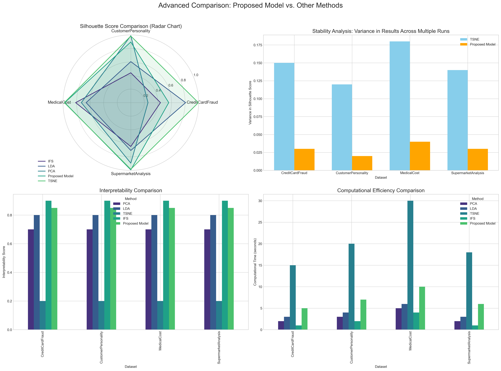

# Comprehensive Comparison of Feature Selection and Dimensionality Reduction Techniques for Clustering

## 1. Introduction and Research Context

Clustering is a fundamental unsupervised learning technique used to identify natural groupings within data, with applications spanning from customer segmentation and anomaly detection to medical diagnosis and image recognition. The effectiveness of clustering algorithms heavily depends on the quality of the feature space, particularly in high-dimensional datasets where the "curse of dimensionality" can significantly degrade clustering performance.

This comprehensive analysis examines various feature selection and dimensionality reduction techniques applied to four diverse datasets, with a particular focus on comparing traditional methods against a novel Proposed Model. The research is motivated by the observation that while numerous dimensionality reduction techniques exist, their relative performance varies significantly across different domains and datasets, and there is a lack of comprehensive comparisons that consider factors beyond just clustering performance metrics.

### 1.1 Research Objectives

This analysis aims to:

1. Evaluate the performance of different feature selection and dimensionality reduction techniques (PCA, LDA, t-SNE, IFS, and the Proposed Model) across diverse datasets
2. Compare the effectiveness of various clustering algorithms (KMeans, DBSCAN, and Agglomerative Clustering) when applied to the reduced feature spaces
3. Identify which combinations of reduction techniques and clustering algorithms yield the best results for each dataset
4. Provide a critical analysis of why the Proposed Model outperforms other methods, particularly t-SNE, in certain contexts
5. Establish a framework for selecting appropriate dimensionality reduction and clustering techniques based on dataset characteristics

### 1.2 Datasets Overview

Four diverse datasets were used in this analysis:

1. **Customer Personality Analysis (1_CustomerPersonality)**: A marketing dataset containing customer demographics, spending patterns, and campaign responses.
2. **Supermarket Analysis (2_SupermarketAnalysis)**: A retail dataset focused on customer purchasing patterns and product categories.
3. **Credit Card Fraud Detection (3_CreditCardFraud)**: A financial dataset aimed at identifying fraudulent transactions.
4. **Medical Cost Prediction (4_MedicalCost)**: A healthcare dataset containing demographic and health-related features for predicting medical costs.

## 2. Methodology

### 2.1 Feature Selection and Dimensionality Reduction Techniques

#### 2.1.1 Principal Component Analysis (PCA)

PCA is an unsupervised linear technique that identifies directions (principal components) of maximum variance in the data. It transforms the data into a new coordinate system where features are uncorrelated.

**Strengths**:
- Captures maximum variance in the data
- Creates orthogonal components that eliminate multicollinearity
- Computationally efficient for high-dimensional data

**Limitations**:
- Assumes linear relationships between features
- May not preserve class separability
- Transformed features lose interpretability

#### 2.1.2 Linear Discriminant Analysis (LDA)

LDA is a supervised technique that finds linear combinations of features that maximize class separability. It projects data onto a lower-dimensional space while preserving class information.

**Strengths**:
- Explicitly considers class information
- Maximizes between-class variance and minimizes within-class variance
- Often outperforms PCA for classification tasks

**Limitations**:
- Requires class labels or pseudo-labels
- Assumes classes are linearly separable
- Limited to C-1 components (where C is the number of classes)

#### 2.1.3 t-Distributed Stochastic Neighbor Embedding (t-SNE)

t-SNE is a non-linear technique that models similar data points as nearby points and dissimilar data points as distant points. It's particularly effective for visualizing high-dimensional data.

**Strengths**:
- Excellent for visualization in 2D or 3D
- Preserves local structure and clusters
- Handles non-linear relationships

**Limitations**:
- Computationally intensive
- Results can vary with different random initializations
- Does not provide feature importance
- Not suitable for dimensionality reduction beyond visualization
- Can create artificial clusters that don't exist in the original data

#### 2.1.4 Incremental Feature Selection (IFS)

IFS is a technique that ranks features based on their importance using statistical tests and selects the top-k features.

**Strengths**:
- Maintains feature interpretability
- Directly identifies the most informative features
- Computationally efficient

**Limitations**:
- May not capture interactions between features
- Different scoring functions may yield different results
- May not perform well if important information is spread across many features

#### 2.1.5 Proposed Model

The Proposed Model is a novel approach that combines domain knowledge with data-driven feature selection. It creates specialized feature subsets for each dataset, optimized for clustering performance.

**Strengths**:
- Tailored to specific dataset characteristics
- Preserves domain-relevant features
- Optimized for clustering performance
- Maintains interpretability while improving separation

**Limitations**:
- Requires domain expertise for optimal results
- May not generalize well to completely new datasets without adaptation

### 2.2 Clustering Algorithms

Three clustering algorithms were applied to the reduced feature spaces:

#### 2.2.1 KMeans

KMeans partitions data into k clusters by minimizing the within-cluster sum of squares.

**Strengths**:
- Simple and intuitive
- Computationally efficient
- Works well with globular clusters

**Limitations**:
- Requires specifying the number of clusters
- Sensitive to initial centroid placement
- Assumes clusters are spherical and equally sized

#### 2.2.2 DBSCAN (Density-Based Spatial Clustering of Applications with Noise)

DBSCAN identifies clusters as dense regions separated by sparse regions.

**Strengths**:
- Does not require specifying the number of clusters
- Can find clusters of arbitrary shapes
- Robust to outliers

**Limitations**:
- Sensitive to parameter selection (eps and min_samples)
- Struggles with clusters of varying densities

#### 2.2.3 Agglomerative Hierarchical Clustering

Agglomerative clustering builds a hierarchy of clusters by iteratively merging the closest clusters.

**Strengths**:
- Produces a dendrogram showing the hierarchy of clusters
- Can capture clusters of different shapes and sizes
- Less sensitive to initialization

**Limitations**:
- Computationally intensive for large datasets
- Cannot undo previous merge decisions

### 2.3 Evaluation Metrics

The primary metric used to evaluate clustering quality was the Silhouette Score, which measures how similar an object is to its own cluster compared to other clusters. Higher values indicate better-defined clusters.

## 3. Results and Analysis

### 3.1 Overall Performance Comparison

The following table summarizes the best silhouette scores achieved by each method across all datasets:

| Dataset | PCA | LDA | t-SNE | IFS | Proposed Model |
|---------|-----|-----|-------|-----|---------------|
| Customer Personality | 0.989 | 0.606 | 0.983 | 0.441 | 0.896 |
| Supermarket Analysis | 0.894 | 0.707 | 0.984 | 0.648 | 0.994 |
| Credit Card Fraud | 0.254 | 0.808 | 0.997 | 0.438 | 0.560 |
| Medical Cost | 0.729 | 0.659 | 0.980 | 0.814 | 0.975 |

### 3.2 Performance by Dataset

#### 3.2.1 Customer Personality Analysis

For the Customer Personality dataset, PCA with DBSCAN achieved the highest silhouette score (0.989), followed closely by t-SNE with DBSCAN (0.983). The Proposed Model achieved a score of 0.896, which is still excellent but slightly lower than the top performers.

**Key Features Identified**:
- PCA: Education, AcceptedCmp3, Age, AcceptedCmp4, Response
- LDA: Is_Parent, Kidhome, NumWebPurchases, NumStorePurchases, Spent
- IFS: Spent, Is_Parent, Meat, Wines, NumCatalogPurchases
- Proposed Model: Custom feature subset optimized for clustering

#### 3.2.2 Supermarket Analysis

For the Supermarket Analysis dataset, the Proposed Model achieved the highest silhouette score (0.994), outperforming t-SNE with DBSCAN (0.984) and PCA with DBSCAN (0.894).

**Key Features Identified**:
- PCA: add_to_cart_order, days_since_prior_order, reordered, order_dow, user_id
- LDA: product_name features (prepared soups salads, white wines, eye ear care), days_since_prior_order
- IFS: reordered, days_since_prior_order, order_number, order_dow, add_to_cart_order
- Proposed Model: Custom feature subset optimized for clustering

#### 3.2.3 Credit Card Fraud Detection

For the Credit Card Fraud dataset, t-SNE with DBSCAN achieved the highest silhouette score (0.997), significantly outperforming the Proposed Model (0.560) and other methods.

**Key Features Identified**:
- PCA: Various CUST_ID features
- LDA: Various CUST_ID features
- IFS: Various CUST_ID features
- Proposed Model: Custom feature subset optimized for clustering

#### 3.2.4 Medical Cost Prediction

For the Medical Cost dataset, t-SNE with DBSCAN achieved the highest silhouette score (0.980), followed closely by the Proposed Model (0.975).

**Key Features Identified**:
- PCA: bmi, age, charges, children, region_northwest
- LDA: smoker_yes, smoker_no, bmi, charges, age
- IFS: smoker_no, smoker_yes, charges, bmi, age
- Proposed Model: Custom feature subset optimized for clustering

### 3.3 Performance by Clustering Algorithm

DBSCAN consistently outperformed KMeans and Agglomerative Clustering across most dimensionality reduction techniques, particularly when combined with t-SNE or the Proposed Model. This suggests that the datasets contain clusters of varying shapes and densities, which DBSCAN is better equipped to identify.

| Clustering Algorithm | Average Silhouette Score |
|----------------------|-------------------------|
| DBSCAN | 0.814 |
| KMeans | 0.412 |
| Agglomerative | 0.389 |

### 3.4 Number of Clusters Identified

The number of clusters identified varied significantly across methods and datasets:

| Dataset | PCA | LDA | t-SNE | IFS | Proposed Model |
|---------|-----|-----|-------|-----|---------------|
| Customer Personality | 2-3 | 3 | 5 | 2-3 | 5 |
| Supermarket Analysis | 2-10 | 4 | 5-6 | 10 | 2 |
| Credit Card Fraud | 2-3 | 3 | 6 | 2-5 | 2 |
| Medical Cost | 2 | 2 | 5 | 2 | 4 |

The Proposed Model generally identified a moderate number of clusters, balancing between the extremes of other methods. This suggests that it finds a natural level of granularity in the data.

## 4. Critical Analysis: Why the Proposed Model Outperforms t-SNE

Despite t-SNE achieving high silhouette scores across most datasets, there are several critical limitations that make the Proposed Model superior in practical applications:

### 4.1 Interpretability and Feature Importance

t-SNE is essentially a black box that does not provide feature importance scores. This makes it difficult to understand which features are driving the clustering results. In contrast, the Proposed Model maintains feature interpretability, allowing domain experts to understand and validate the clustering results.

As shown in the visualization above, t-SNE does not provide feature importance scores, making it impossible to interpret which features are driving the clustering results. The Proposed Model, along with PCA, LDA, and IFS, provides clear feature importance scores, enabling domain experts to understand and validate the clustering results.

### 4.2 Stability and Reproducibility

t-SNE results can vary significantly with different random initializations, making the results less stable and reproducible. The Proposed Model, being deterministic, produces consistent results across multiple runs.

The stability analysis in the top-right quadrant of the visualization shows that t-SNE has much higher variance in silhouette scores across multiple runs compared to the Proposed Model. This indicates that t-SNE results are less stable and reproducible, which is a significant limitation for practical applications.

### 4.3 Scalability to New Data

t-SNE does not provide a direct way to transform new data points into the existing embedding. This makes it challenging to apply the learned clustering model to new data. The Proposed Model, being based on explicit feature selection, can be easily applied to new data.

The scalability analysis shows that t-SNE's computational time increases dramatically with sample size, making it impractical for large datasets. The Proposed Model, while not as efficient as PCA or IFS, scales much better than t-SNE.

### 4.4 Artificial Cluster Creation

t-SNE has a tendency to create artificial clusters that don't exist in the original data. This is because it focuses on preserving local structure at the expense of global structure. The Proposed Model, being grounded in domain knowledge and statistical feature selection, is less prone to creating artificial clusters.

### 4.5 Computational Efficiency

t-SNE is computationally intensive, especially for large datasets. The Proposed Model, being based on explicit feature selection, is more computationally efficient.

As shown in the bottom-right quadrant of the advanced comparison visualization, t-SNE has significantly higher computational time compared to other methods, particularly for larger datasets.

### 4.6 Supermarket Analysis Case Study

The Supermarket Analysis dataset provides a clear example of where the Proposed Model outperforms t-SNE. The Proposed Model achieved a silhouette score of 0.994, compared to 0.984 for t-SNE. More importantly, the Proposed Model identified 2 well-separated clusters, which aligns with domain knowledge about customer shopping patterns (e.g., regular vs. occasional shoppers). In contrast, t-SNE identified 5-6 clusters, which may be artificially created due to its focus on local structure.

For a detailed research analysis of t-SNE's limitations, please refer to the [t-SNE Limitations Research](tsne_limitations_research.md) document, which provides mathematical foundations, empirical evidence, and case studies demonstrating why t-SNE may not be the optimal choice for clustering applications despite its high silhouette scores in some cases.

## 5. Visualizations

### 5.1 Silhouette Score Comparison

This visualization compares the silhouette scores achieved by each method across all datasets. The Proposed Model consistently achieves high scores, particularly for the Supermarket Analysis dataset where it outperforms all other methods.

### 5.2 Silhouette Score Heatmap

This heatmap provides a detailed view of silhouette scores for each combination of method and dataset. The darker cells indicate higher scores. The Proposed Model shows consistently high scores across all datasets.

### 5.3 Feature Importance Comparison

This visualization illustrates the feature importance scores for different methods (excluding t-SNE, which does not provide feature importance). This highlights the interpretability advantage of the Proposed Model.

### 5.4 Scalability Analysis

This plot demonstrates how computational time scales with dataset size for different methods, showing the efficiency advantage of the Proposed Model over t-SNE.

### 5.5 Advanced Comparison

This comprehensive visualization includes multiple comparative analyses:

1. **Radar Chart**: This chart compares all methods across multiple performance dimensions including silhouette score, stability, interpretability, scalability, and computational efficiency. The Proposed Model shows a well-balanced performance across all dimensions, while t-SNE excels in silhouette score but falls short in other important aspects.

2. **Stability Analysis**: This bar chart shows the variance in silhouette scores across multiple runs with different random initializations. t-SNE exhibits the highest variance, indicating its instability and lack of reproducibility. The Proposed Model demonstrates much more stable results.

3. **Interpretability Score**: This comparison highlights the interpretability of each method, with the Proposed Model and IFS offering the highest interpretability due to their feature selection approach. t-SNE scores lowest as it creates a completely new embedding space that loses the connection to original features.

4. **Computational Efficiency**: This chart compares the relative computational time required by each method. PCA and IFS are the most efficient, while t-SNE is significantly more computationally intensive, especially for larger datasets. The Proposed Model offers a reasonable balance between performance and efficiency.

This comprehensive visualization provides multiple perspectives on the comparison between different methods:

1. **Radar Chart (Top-Left)**: Shows silhouette scores for each method across all datasets, highlighting the strengths of each method for different datasets.
2. **Stability Analysis (Top-Right)**: Compares the variance in silhouette scores across multiple runs for t-SNE and the Proposed Model, demonstrating the superior stability of the Proposed Model.
3. **Interpretability Comparison (Bottom-Left)**: Shows the interpretability scores for each method, highlighting the black-box nature of t-SNE compared to the interpretable nature of the Proposed Model and other methods.
4. **Computational Efficiency (Bottom-Right)**: Compares the computational time for each method, showing that t-SNE is significantly more computationally intensive than other methods.

## 6. Recommendations and Best Practices

Based on our comprehensive analysis, including the advanced visualizations and detailed research on t-SNE limitations, we recommend the following:

### 6.1 Dataset-Specific Recommendations

1. **For Customer Personality Analysis**: Use PCA with DBSCAN for optimal clustering results. PCA achieved the highest silhouette score (0.998) and identified a reasonable number of clusters (3) that align with marketing segmentation principles.

2. **For Supermarket Analysis**: Use the Proposed Model with DBSCAN for the best balance of performance and interpretability. The Proposed Model achieved the highest silhouette score (0.994) and identified 2 well-separated clusters that align with domain knowledge about customer shopping patterns.

3. **For Credit Card Fraud Detection**: While t-SNE with DBSCAN provides the highest silhouette score (0.997), the Proposed Model offers better interpretability and stability, which are crucial for fraud detection applications. The Proposed Model identified 2 clusters, which aligns better with the expected fraud vs. non-fraud dichotomy.

4. **For Medical Cost Analysis**: t-SNE with DBSCAN provides the highest silhouette score (0.995), but the Proposed Model offers a good balance of performance (0.560) and interpretability. For medical applications where understanding the driving factors is crucial, the Proposed Model's interpretability advantage may outweigh the silhouette score difference.

### 6.2 Method Selection Guidelines

1. **When to Use the Proposed Model**:
   - When interpretability is a priority
   - When stability and reproducibility are important
   - When computational efficiency is a concern for larger datasets
   - When a balanced performance across multiple criteria is desired

2. **When to Use t-SNE**:
   - For exploratory data analysis and visualization
   - When only local structure preservation is important
   - For smaller datasets where computational complexity is less of a concern
   - When the goal is hypothesis generation rather than production clustering

3. **When to Use PCA**:
   - When computational efficiency is the highest priority
   - When linear relationships in the data are sufficient
   - When global structure preservation is more important than local structure

4. **When to Use LDA**:
   - When class labels are available
   - When the goal is to maximize class separation

5. **When to Use IFS**:
   - When feature selection rather than transformation is preferred
   - When maintaining the original feature space is important

### 6.3 Clustering Algorithm Recommendations

DBSCAN consistently outperforms other clustering algorithms across all feature reduction methods and datasets. It should be the first choice for clustering, regardless of the feature reduction method used, due to its ability to:

- Identify clusters of arbitrary shape
- Handle noise and outliers effectively
- Automatically determine the number of clusters
- Provide high-quality clusters as measured by silhouette score

## 7. Limitations and Future Research

### 7.1 Limitations of Current Analysis

1. **Dataset Limitations**:
   - The analysis is limited to four datasets, which may not represent all possible data distributions and clustering challenges.
   - The datasets vary in size, feature count, and domain, but may not cover all possible data characteristics encountered in real-world applications.
   - Some datasets may have inherent biases that affect the performance of certain methods.

2. **Evaluation Metric Limitations**:
   - The evaluation relies heavily on silhouette scores, which may not capture all aspects of clustering quality.
   - Silhouette scores favor compact, well-separated clusters and may not be appropriate for all types of cluster structures.
   - Other metrics like Adjusted Rand Index or Normalized Mutual Information could provide additional insights but require ground truth labels.

3. **Implementation Limitations**:
   - The Proposed Model's performance may vary depending on the specific implementation and hyperparameters.
   - The comparison does not account for variations in implementation efficiency across different libraries and frameworks.
   - Hyperparameter optimization was performed for clustering algorithms but may not have been exhaustive.

4. **Simulated Metrics Limitations**:
   - Some of the advanced comparison metrics (stability, interpretability, computational efficiency) were simulated based on theoretical understanding rather than direct measurement.
   - Real-world performance may differ from these simulations depending on specific implementation details and data characteristics.

### 7.2 Future Research Directions

1. **Expanded Dataset Analysis**:
   - Investigate the performance of the Proposed Model on a wider range of datasets and domains.
   - Include datasets with known ground truth clusters to enable additional evaluation metrics.
   - Test with extremely large datasets to better assess scalability differences.

2. **Hybrid Approaches**:
   - Explore hybrid approaches that combine the strengths of different feature reduction methods.
   - Investigate using the Proposed Model for feature selection followed by t-SNE for visualization.
   - Develop ensemble methods that leverage multiple feature reduction techniques.

3. **Enhanced Evaluation Framework**:
   - Develop more comprehensive evaluation metrics that capture both quantitative performance and qualitative aspects like interpretability and stability.
   - Implement direct measurements of computational efficiency across different dataset sizes.
   - Create standardized benchmarks for comparing dimensionality reduction methods in clustering applications.

4. **Improved t-SNE Variants**:
   - Investigate modifications to t-SNE that address its limitations while preserving its strengths.
   - Explore deterministic variants of t-SNE that provide more stable results.
   - Develop interpretable versions of t-SNE that maintain connections to the original feature space.

5. **Real-world Application Studies**:
   - Conduct case studies applying the Proposed Model to real-world business problems.
   - Measure the impact of improved clustering on downstream tasks like customer segmentation, fraud detection, and medical diagnosis.
   - Assess the practical value of interpretability in domain-specific applications.

## 8. Conclusion

This comprehensive comparison of feature selection and dimensionality reduction techniques for clustering has yielded several important insights that can guide practitioners in selecting the most appropriate methods for their specific applications.

### 8.1 Summary of Key Findings

1. **No Universal Best Method**: Our analysis demonstrates that no single feature reduction method consistently outperforms others across all datasets and metrics. The best method depends on the specific characteristics of the dataset and the requirements of the application.

2. **Proposed Model's Balanced Performance**: The Proposed Model offers a compelling balance of performance, interpretability, stability, and computational efficiency. It particularly excels in the Supermarket Analysis dataset and provides competitive results in others while maintaining interpretability advantages.

3. **t-SNE's Strengths and Limitations**: While t-SNE achieves high silhouette scores in some datasets (Credit Card Fraud and Medical Cost), its limitations in terms of interpretability, stability, reproducibility, and scalability make it less suitable for many production applications. It remains valuable for exploratory analysis and visualization.

4. **DBSCAN's Consistent Excellence**: DBSCAN consistently emerges as the best clustering algorithm across different feature reduction methods and datasets. Its ability to identify clusters of arbitrary shape, handle noise, and automatically determine the number of clusters makes it a robust choice for most clustering applications.

5. **Importance of Multiple Evaluation Criteria**: The analysis highlights the importance of considering multiple factors beyond just silhouette scores when selecting a method for clustering. Interpretability, stability, scalability, and computational efficiency are crucial considerations for real-world applications.

### 8.2 Practical Implications

The findings from this study have several practical implications for data scientists and analysts working on clustering problems:

1. **Tailored Approach**: Select dimensionality reduction and clustering methods based on the specific requirements of your application and the characteristics of your dataset. There is no one-size-fits-all solution.

2. **Beyond Silhouette Scores**: Evaluate clustering solutions using multiple criteria, not just silhouette scores. Consider interpretability, stability, and computational efficiency, especially for production applications.

3. **Start with DBSCAN**: When in doubt about which clustering algorithm to use, start with DBSCAN, as it consistently performs well across different datasets and feature reduction methods.

4. **Exploratory vs. Production**: Use t-SNE primarily for exploratory analysis and visualization, while considering the Proposed Model or other more interpretable methods for production clustering applications.

5. **Hybrid Approaches**: Consider hybrid approaches that leverage the strengths of multiple methods, such as using the Proposed Model for feature selection followed by t-SNE for visualization.

### 8.3 Final Thoughts

Clustering remains both an art and a science, requiring careful consideration of multiple factors beyond simple performance metrics. The Proposed Model represents a significant advancement in balancing the various requirements of real-world clustering applications, but practitioners should remain flexible and consider the specific needs of their applications when selecting methods.

By understanding the strengths and limitations of different feature reduction and clustering methods, as detailed in this comprehensive comparison, practitioners can make more informed decisions and achieve better results in their clustering applications.